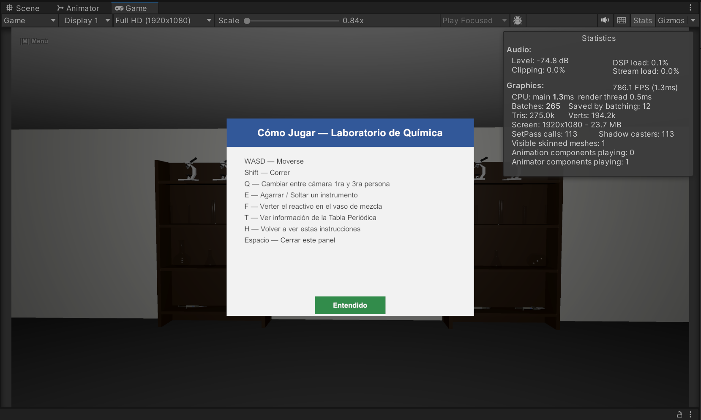
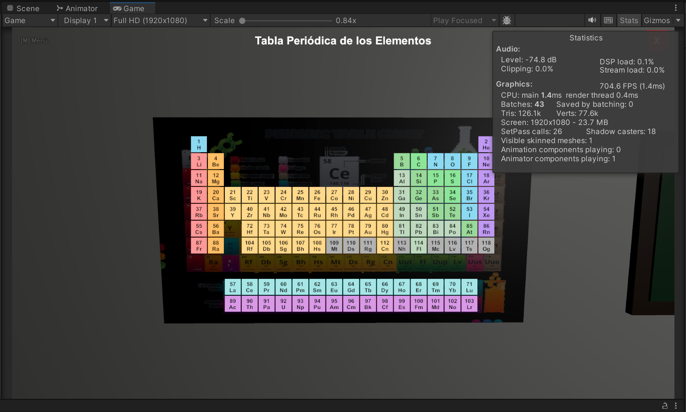
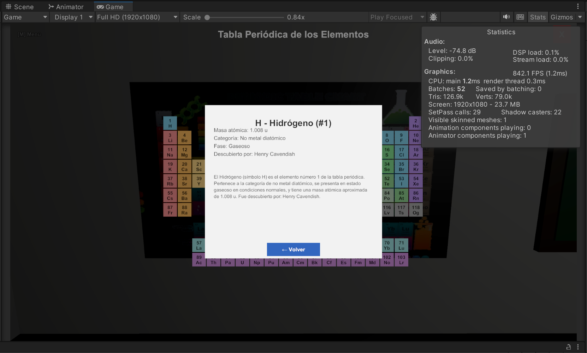
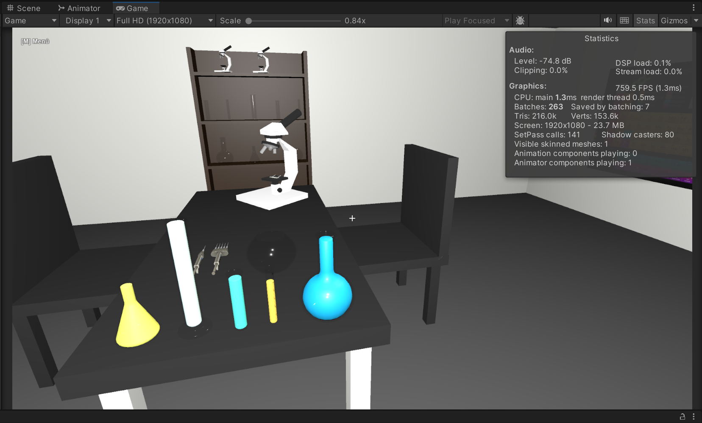
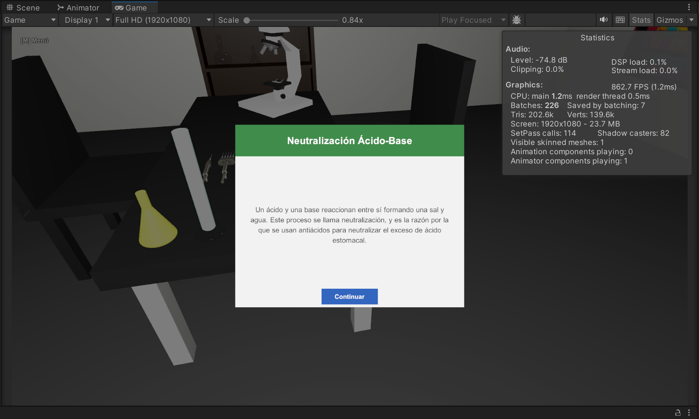
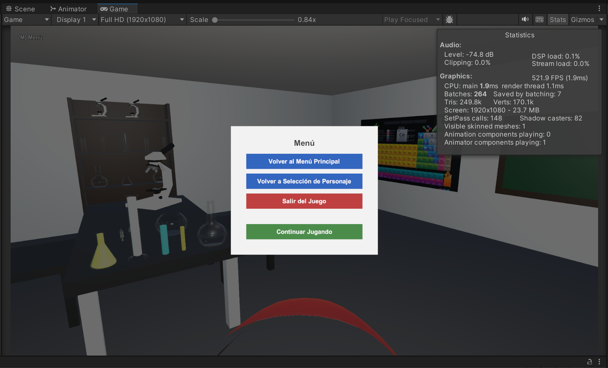
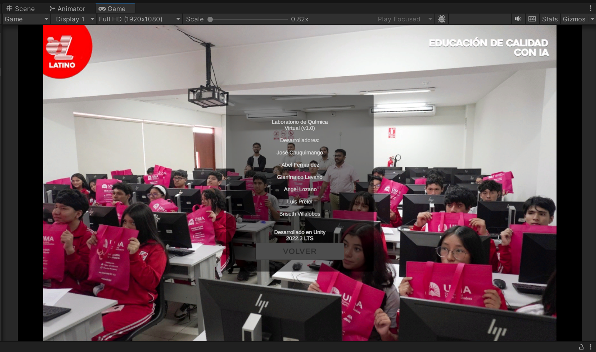

# 🧪 Digital Twin de Laboratorio de Química
### I.E.P Latino — Educación de Calidad con IA

Laboratorio de química virtual interactivo desarrollado en Unity, diseñado para estudiantes de secundaria que no cuentan con acceso a un laboratorio físico.

---

## 📋 Descripción del Problema

En el **Colegio Privado Latino**, la enseñanza de Ciencias es principalmente teórica, basada en libros y pizarras. La falta de un laboratorio físico impide realizar experimentos reales, obligando a los estudiantes a imaginar los procesos y dificultando su comprensión. Como resultado, se genera desinterés, dudas y desventaja frente a otros colegios.

**Digital Twin de Laboratorio** resuelve este problema creando un laboratorio virtual inmersivo donde los estudiantes pueden:
- 🔬 Explorar un laboratorio equipado en primera y tercera persona
- ⚗️ Interactuar con instrumentos de química reales (frascos, pipetas, microscopios)
- 🧪 Realizar reacciones químicas combinando reactivos, con efectos visuales y explicaciones educativas
- 📊 Consultar una Tabla Periódica interactiva con los 118 elementos, completamente en español
- 🧑‍🔬 Seleccionar un avatar personalizado (niño o niña)
- 🎮 Aprender de forma práctica y motivadora

---

## 🖼️ Capturas del Proyecto

### Menú Principal


### Selección de Personaje


| Personaje Niño | Personaje Niña |
|---|---|
|  |  |

### Laboratorio Principal


### Panel de Instrucciones


### Tabla Periódica Interactiva


### Detalle de un Elemento


### Sistema de Reacciones Químicas
| Vertiendo reactivos en el punto de mezcla | Resultado de la reacción |
|---|---|
|  |  |

### Menú Principal — Confirmación de Salida


### Menú Principal — Créditos


---

## 🛠️ Tecnologías Utilizadas

| Tecnología | Versión | Uso |
|---|---|---|
| **Unity** | 2022.3.62f1 LTS | Motor de videojuego |
| **C#** | — | Lenguaje de programación |
| **Mixamo (Adobe)** | — | Personajes y animaciones 3D |
| **UnityEngine.UI (uGUI)** | — | Toda la interfaz generada por código |
| **GitHub** | — | Control de versiones |

### Assets utilizados
- 🧪 **Free Laboratory Pack** — Unity Asset Store (instrumentos de vidrio)
- 🔬 **Microscopio 3D** — Poly.pizza (modelo OBJ gratuito)
- 📊 **Datos de la Tabla Periódica** — Adaptado de [Periodic-Table-JSON](https://github.com/Bowserinator/Periodic-Table-JSON), traducido y curado al español

---

## 💻 Requisitos de Instalación

### Requisitos mínimos del sistema
- **OS:** Windows 10 / 11 (64-bit)
- **RAM:** 8 GB mínimo
- **GPU:** Tarjeta gráfica con soporte DirectX 11
- **Almacenamiento:** 2 GB libres

### Para desarrolladores (editar el proyecto)
- **Unity Hub** instalado
- **Unity 2022.3 LTS** (versión exacta: 2022.3.62f1)
- **Visual Studio Code** o Visual Studio 2022
- **Git** instalado

---

## 🚀 Cómo Ejecutar

### Opción A — Ejecutar el juego compilado
```
1. Descarga la carpeta Build/ del repositorio
2. Ejecuta LaboratorioQuimica.exe
3. El juego inicia automáticamente desde el Menú Principal
```

### Opción B — Abrir en Unity Editor
```
1. Clona el repositorio:
   git clone https://github.com/fernandez-7/LaboratorioQuimica

2. Abre Unity Hub → Add → selecciona la carpeta clonada

3. Asegúrate de tener Unity 2022.3 LTS instalado

4. Abre la escena: Assets/Scenes/MenuPrincipal.unity

5. Presiona ▶ Play
```

### 🎮 Controles del juego

| Tecla | Acción |
|---|---|
| `W A S D` | Moverse |
| `Shift` | Correr |
| `Mouse` | Mirar alrededor |
| `Q` | Cambiar entre 1ra y 3ra persona |
| `E` | Agarrar / Soltar un instrumento |
| `F` | Verter el reactivo en el vaso de mezcla |
| `T` | Ver información de la Tabla Periódica |
| `H` | Ver instrucciones / controles del juego |
| `M` | Abrir menú de pausa (salir, cambiar personaje, etc.) |
| `Escape` | Cerrar cualquier panel abierto |

---

## 📁 Estructura del Proyecto

```
Assets/
├── Audio/
├── Characters/              # Personajes Timmy y Amy (Mixamo)
│   ├── BoyTextures/
│   ├── GirlTextures/
│   └── PersonajeAnimator.controller
├── Materials/
├── Models/
│   └── Microscopio/
├── Prefabs/
├── Reactivos/                # Assets ScriptableObject de sustancias químicas
├── Reacciones/                # Assets ScriptableObject de recetas de reacciones
├── Resources/
│   └── PeriodicTable.json     # Datos de los 118 elementos, en español
├── Scenes/
│   ├── MenuPrincipal.unity
│   ├── SeleccionPersonaje.unity
│   └── Laboratorio_Principal.unity
├── Scripts/
│   ├── MenuManager.cs
│   ├── SeleccionPersonaje.cs
│   ├── ControladorPersonaje.cs
│   ├── SpawnManager.cs
│   ├── InteraccionJugador.cs          # Agarrar / soltar instrumentos
│   ├── ElementoQuimico.cs             # Estructura de datos de un elemento
│   ├── TablaPeriodicaData.cs          # Carga del JSON de la tabla periódica
│   ├── InfoTablaInteraccion.cs        # Deteccion + tecla T
│   ├── PanelTablaPeriodica.cs         # Grilla de 118 elementos + detalle
│   ├── Reactivo.cs                    # ScriptableObject: sustancia química
│   ├── ContenedorQuimico.cs           # Componente: que reactivo contiene un frasco
│   ├── ReaccionQuimica.cs             # ScriptableObject: receta de reacción
│   ├── BaseDeReacciones.cs            # ScriptableObject: catálogo de recetas
│   ├── PuntoMezcla.cs                 # Logica de verter y evaluar reacciones
│   ├── PanelResultadoReaccion.cs      # Panel de resultado de una reacción
│   ├── PanelInstrucciones.cs          # Panel de controles (tecla H)
│   ├── PanelMenuPausa.cs              # Menú de pausa (tecla M)
│   └── GestorProgreso.cs              # Registro de reacciones descubiertas
├── Textures/
└── ThirdParty/
    └── FreeLabAssets/
```

---

## ✅ Estado del Proyecto

> 🎉 **Versión actual: 100% completado — Proyecto finalizado**

Todas las fases planificadas fueron completadas y probadas de principio a fin.

| Fase | Descripción | Estado |
|---|---|---|
| **Fase 1** | Laboratorio visual (escenario, mobiliario, instrumentos) | ✅ Completo |
| **Fase 2** | Menú principal, selección de personaje, sistema de cámaras | ✅ Completo |
| **Fase 3** | Sistema de interacción con objetos (agarrar / soltar) | ✅ Completo |
| **Fase 4** | Tabla Periódica interactiva + Reacciones químicas con efectos visuales | ✅ Completo |
| **Fase 5** | HUD / UI del juego (instrucciones, menú de pausa) | ✅ Completo |

### Funcionalidades destacadas de las últimas fases

- **Tabla Periódica interactiva:** los 118 elementos químicos, completamente en español, organizados en el formato estándar real (incluye la fila separada de Lantánidos/Actínidos). Cada elemento muestra nombre, símbolo, número atómico, masa, categoría, fase, descubridor y una descripción.
- **Sistema de reacciones químicas:** el jugador agarra reactivos, los vierte en un punto de mezcla, y el sistema detecta automáticamente si la combinación produce una reacción real (por ejemplo, neutralización ácido-base o efervescencia), mostrando el resultado visual (cambio de color, burbujeo) junto con una explicación educativa. El sistema está diseñado para escalar fácilmente a más reacciones sin modificar código, solo agregando nuevos assets de datos.
- **HUD completo:** panel de instrucciones (tecla H), menú de pausa con opciones de salir o cambiar de personaje (tecla M).

---

## 👥 Equipo de Desarrollo

| Nombre | Rol |
|---|---|
| **Fernández Chuse, Abel** | 💻 Programador Principal |
| **Chuquimango Cueva, José** | 🎨 Diseñador de Escenario 3D |
| **Levano Villanueva, Gianfranco** | 🎮 Diseñador de Experiencia de Usuario (UX) |
| **Lozano Salazar, Ángel** | 🔬 Investigador de Contenido Educativo |
| **Pretell Calderón, Luis** | 🧪 Tester y Control de Calidad |
| **Villalobos Acuña, Briseth** | 📋 Gestora de Proyecto y Documentación |

---

## 🎬 Video Demo

> 🎥 **Enlace del video:** https://drive.google.com/file/d/1kfwHeKqBbJs_SbVo0rP3-ig4fNmcvNrc/view?usp=sharing

---

## 📌 Notas Técnicas

- **NO actualizar** Unity a versiones superiores a 2022.3 LTS
- **NUNCA** mover archivos desde el Explorador de Windows — siempre usar el Panel Project de Unity
- Hacer **commit en GitHub** después de cada sesión de trabajo
- La escena principal de inicio es `MenuPrincipal`
- Toda la interfaz (HUD, paneles, tabla periódica) se genera **por código en tiempo de ejecución**, no como objetos fijos en el Editor — esto evita inconsistencias entre escenas y facilita el mantenimiento

---

<div align="center">
  <strong>🧪 Digital Twin de Laboratorio de Química</strong><br>
  Desarrollado con Unity 2022.3 LTS · C# · Mixamo · GitHub<br><br>
  <em>"Educación de Calidad"</em>
</div>
